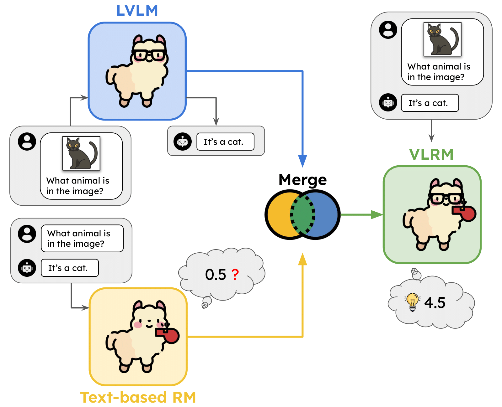

<div align="center">

# Transferring Textual Preferences to Vision-Language Understanding through Model Merging

[](https://arxiv.org/abs/2502.13487)

<p align="center">



<em>Framework for merging a text-based Reward Model (RM) with a Large Vision-Language Model (LVLM). LVLMs excel at visual tasks, while text-based RMs struggle to provide accurate rewards without visual contexts. Our approach transfers textual preferences to vision-language understanding, resulting in a Vision-Language Reward Model (VLRM). All icons used in this figure are sourced from https://www.flaticon.com/</em>

</p>

</div>

## Table of Contents
- [Overview](#overview)
- [Setup](#setup)
  - [1. Clone the Repository](#1-clone-the-repository)
  - [2. Prepare Environment](#2-prepare-environment)
- [Model Merging Pipeline](#model-merging-pipeline)
  - [1. Install mergekit](#1-install-mergekit)
  - [2. Extract Language Model Components](#2-extract-language-model-components)
  - [3. Perform Model Merging](#3-perform-model-merging)
- [Evaluation](#evaluation)
  - [VL-RewardBench](#vl-rewardbench)
    - [1. Get Scores](#1-get-scores)
    - [2. Check Results](#2-check-results)
  - [Best-of-N Evaluation](#best-of-n-evaluation)
    - [1. Install lmms-eval](#1-install-lmms-eval)
    - [2. Generate Responses (N=8)](#2-generate-responses-n8)
    - [3. Aggregate Generations](#3-aggregate-generations)
    - [4. Get Scores](#4-get-scores)
    - [5. Check Results](#5-check-results)
  - [RLAIF_V](#rlaif_v)
    - [1. Get Scores](#1-get-scores)
    - [2. Check Results](#2-check-results)
- [Reference Repositories](#reference-repositories)
- [Citation](#citation)

## Overview

This repository contains the implementation for our paper [Transferring Textual Preferences to Vision-Language Understanding through Model Merging](https://arxiv.org/abs/2502.13487). We present methods to merge text reward models with vision-language models to enhance multimodal preference alignment.

## Setup

#### 1. Clone the repository

```
git clone https://github.com/lca0503/MergeToVLRM.git
cd MergeToVLRM
```

#### 2. Prepare Environment

```
pip install -r requirements.txt
```

## Model Merging Pipeline

#### 1. Install mergekit

Install the [mergekit](https://github.com/arcee-ai/mergekit) library to facilitate model merging workflows.

#### 2. Extract language model components
First, extract the language model components from the vision-language model and the text reward model:

- Large Vision-Language Model: [meta-llama/Llama-3.2-11B-Vision-Instruct](https://huggingface.co/meta-llama/Llama-3.2-11B-Vision-Instruct)
- Text Reward Models: 
  - [allenai/llama-3.1-tulu-2-8b-uf-mean-rm](https://huggingface.co/allenai/llama-3.1-tulu-2-8b-uf-mean-rm) (default)
  - [allenai/Llama-3.1-Tulu-3-8B-RM](https://huggingface.co/allenai/Llama-3.1-Tulu-3-8B-RM)

Run the extraction script:
```bash
bash scripts/merging/run_extract_tlm.sh
```

The extracted models will be saved in:
- LVLM text component: `./models/mllama_t/`
- Text Reward Model: `./models/tulu_t/`

#### 3. Perform Model Merging


| Merging Method       | Script                                  |
|----------------------|------------------------------------------|
| Linear               | `bash scripts/merging/run_linear.sh`    |
| Task Vector          | `bash scripts/merging/run_task_vector.sh` |
| TIES                 | `bash scripts/merging/run_ties.sh`      |
| DARE with Task Vector | `bash scripts/merging/run_dare_linear.sh` |
| DARE with TIES       | `bash scripts/merging/run_dare_ties.sh`   |

Note 1: Models will be saved in `./models_vlseq/`. Merging configurations are located in the `scripts/merging/config/` directory.

Note 2: By default, this repo uses `allenai/llama-3.1-tulu-2-8b-uf-mean-rm`.  To test with `allenai/Llama-3.1-Tulu-3-8B-RM`, update `./scripts/merging/run_extract_tlm.sh` and each `scripts/merging/run_${method}.sh` script accordingly.

---

## Evaluation

### VL-RewardBench

#### 1. Get Scores

To evaluate a text RM on VL-RewardBench, run:
```bash
python3 src/vl_rewardbench.py \
	--output_path ${path_to_save_output} \
	--model_id ${model_name} \
	--text_only
```

To evaluate Cascade approach on VL-RewardBench, run (you can skip the get_caption step as we provide pre-saved captions in `./caption/`):
```bash
python3 src/get_caption.py \
        --output_path "./caption/vl_rewardbench.json" \
        --task "vl_rewardbench" \
        --model_id "meta-llama/Llama-3.2-11B-Vision-Instruct"

python3 src/vl_rewardbench.py \
	--output_path ${path_to_save_output} \
	--model_id ${model_name} \
	--caption_path "./caption/vl_rewardbench.json" \
	--caption
```

To evaluate a VLRM on VL-RewardBench, run:
```bash
python3 src/vl_rewardbench.py \
	--output_path ${path_to_save_output} \
	--model_id ${model_name}
```

To evaluate a VLRM on VL-RewardBench without using image input, run:
```bash
python3 src/vl_rewardbench.py \
	--output_path ${path_to_save_output} \
	--model_id ${model_name} \
	--no_image
```

After merging models, we evaluate the effect of merging parameters on VL-RewardBench with the following scripts:

| Merging Method       | Script                                  |
|----------------------|------------------------------------------|
| Linear               | `bash scripts/vl_rewardbench/search_linear.sh`    |
| Task Vector          | `bash scripts/vl_rewardbench/search_task_vector.sh` |
| TIES                 | `bash scripts/vl_rewardbench/search_ties.sh`      |
| DARE with Task Vector | `bash scripts/vl_rewardbench/search_dare_linear.sh` |
| DARE with TIES       | `bash scripts/vl_rewardbench/search_dare_ties.sh`   |

Results will be saved in `./results/VL_RewardBench/`

#### 2. Check results

```bash
python3 src/vl_rewardbench_results.py --input_path ${path_to_jsonl_with_scores}
```

### Best-of-N Evaluation

This guide shows how to run Best-of-N evaluation for:
- `textvqa_val`
- `mmmu_pro_standard_cot`
- `mmmu_pro_vision_cot`

Results for the first three steps are pre-saved in `./best_of_n/`.

#### 1. Install lmms-eval

Install the [lmms-eval](https://github.com/EvolvingLMMs-Lab/lmms-eval) library.

#### 2. Generate Responses (N=8)

Generate N=8 responses using the [meta-llama/Llama-3.2-11B-Vision-Instruct](https://huggingface.co/meta-llama/Llama-3.2-11B-Vision-Instruct) model. Save outputs to `./logs`.

```bash
bash scripts/generation/gen_${task_name}.sh ./logs
```

#### 3. Aggregate Generations

```bash
python3 src/aggregate_generation.py \
    --input_dir ./logs/${task_name} \
    --output_path ./best_of_n/${task_name}.jsonl \
    --task ${task_name}
```

#### 4. Get Scores

To evaluate a text RM using Best-of-N, run:
```bash
python3 src/get_scores.py \
	--input_path ${path_to_responses} \
	--output_path ${path_to_save_output} \
	--task ${task_name} \
	--model_id ${model_name} \
	--text_only
```

To evaluate Cascade approach using Best-of-N, run (you can skip the get_caption step as we provide pre-saved captions in `./caption/`):
```bash
python3 src/get_caption.py \
        --output_path "./caption/${task_name}.json" \
        --task ${task_name} \
        --model_id "meta-llama/Llama-3.2-11B-Vision-Instruct"

python3 src/get_scores.py \
	--input_path ${path_to_responses} \
	--output_path ${path_to_save_output} \
	--task ${task_name} \
	--model_id ${model_name}
	--caption_path "./caption/${task_name}.json" \
	--caption
```

To evaluate a VLRM using Best-of-N, run:
```bash
python3 src/get_scores.py \
	--input_path ${path_to_responses} \
	--output_path ${path_to_save_output} \
	--task ${task_name} \
	--model_id ${model_name}
```

To evaluate a VLRM using Best-of-N without using image input, run:
```bash
python3 src/get_scores.py \
	--input_path ${path_to_responses} \
	--output_path ${output_path} \
	--task ${task_name} \
	--model_id ${model_name} \
	--no_image
```

After merging models, we evaluate the effect of the merged parameters using Best-of-N with the following scripts:

| Merging Method       | Script                                  |
|----------------------|------------------------------------------|
| Linear               | `bash scripts/${task_name}/search_linear.sh`    |
| Task Vector          | `bash scripts/${task_name}/search_task_vector.sh` |
| TIES                 | `bash scripts/${task_name}/search_ties.sh`      |
| DARE with Task Vector | `bash scripts/${task_name}/search_dare_linear.sh` |
| DARE with TIES       | `bash scripts/${task_name}/search_dare_ties.sh`   |

Results will be saved in `./results/${task_name}/`

#### 5. Check results

```bash
python3 src/get_results.py --input_path ${path_to_jsonl_with_scores}
```

### RLAIF_V

We sample 400 instances from the RLAIF-V training set to create our validation set. The dataset is available at [lca0503/rlaif_v_train_400](https://huggingface.co/datasets/lca0503/rlaif_v_train_400)

#### 1. Get Scores

To evaluate a VLRM on the sampled RLAIF-V set, run:
```bash
python3 src/rlaif_v.py \
	--output_path ${path_to_save_output} \
        --model_id ${model_name}
```

After merging models, we evaluate the effect of merging parameters on the sampled RLAIF-V set with the following scripts:

| Merging Method       | Script                                  |
|----------------------|------------------------------------------|
| Linear               | `bash scripts/rlaif_v/search_linear.sh`    |
| Task Vector          | `bash scripts/rlaif_v/search_task_vector.sh` |
| TIES                 | `bash scripts/rlaif_v/search_ties.sh`      |
| DARE with Task Vector | `bash scripts/rlaif_v/search_dare_linear.sh` |
| DARE with TIES       | `bash scripts/rlaif_v/search_dare_ties.sh`   |

Results will be saved in `./results/RLAIF_V/`

#### 2. Check results

```bash
python3 src/rlaif_v_results.py --input_path ${path_to_jsonl_with_scores}
```

## Reference Repositories

- DogeRM: https://github.com/MiuLab/DogeRM
- mergekit: https://github.com/arcee-ai/mergekit
- lmms-eval: https://github.com/EvolvingLMMs-Lab/lmms-eval
- VL_RewardBench: https://github.com/vl-rewardbench/VL_RewardBench
- MMMU: https://github.com/MMMU-Benchmark/MMMU

## Citation

If you find our code or models helpful, please consider citing our paper using the following BibTeX:
```
@article{li2025transferring,
  title={Transferring Textual Preferences to Vision-Language Understanding through Model Merging},
  author={Li, Chen-An and Lin, Tzu-Han and Chen, Yun-Nung and Lee, Hung-yi},
  journal={arXiv preprint arXiv:2502.13487},
  year={2025}
}
```
